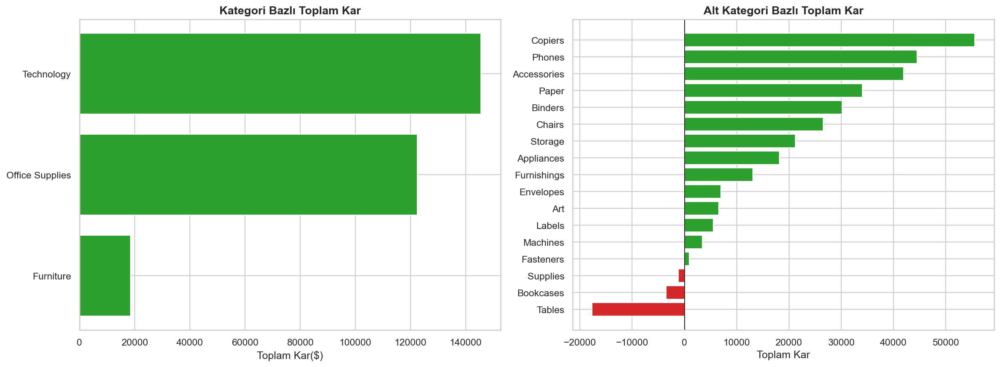
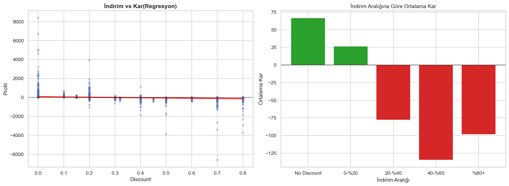

# Superstore Sales Analysis with Python (Pandas)

Superstore satış verisinin Python ekosistemi (Pandas, NumPy, Matplotlib, Seaborn) ile uçtan uca analizi. Bu proje, daha önce SQL ve Power BI ile gerçekleştirdiğim [Superstore Sales Analysis](https://github.com/MetinHrmnc/superstore-sales-analysis) projesinin Pandas karşılığıdır.

##  Proje Amacı
- SQL'de yazılan window function ve aggregation sorgularının Pandas karşılığını üretmek
- Kategori kârlılığı, indirim-kâr ilişkisi, müşteri segmentasyonu ve aylık trend analizlerini Python ortamında tekrarlamak
- Matplotlib ve Seaborn ile karar destek görselleri oluşturmak

##  Dataset
- **Kaynak:** Kaggle — Superstore Sales Dataset (Vivek)
- **Boyut:** 9.994 satır × 21 sütun
- **Dönem:** 2014 – 2017
- **Kapsam:** ABD genelinde Office Supplies, Furniture ve Technology kategorilerinde satışlar

##  Kullanılan Teknolojiler
- **Python 3.12**
- **Pandas** — veri manipülasyonu ve groupby/agg analizleri
- **NumPy** — sayısal işlemler
- **Matplotlib & Seaborn** — görselleştirme
- **Jupyter Notebook** — analitik ortam

##  Repo Yapısı
```
superstore-pandas-analysis/
├── data/                    # Ham veri
├── notebooks/               # Jupyter notebook'ları
│   └── 01_eda.ipynb
├── images/                  # Üretilen görseller
├── requirements.txt
└── README.md
```

##  Yapılan Analizler
1. **Keşifsel Veri Analizi (EDA)** — Veri tipi, null değer, duplicate kontrolleri
2. **Kategori & Sub-Category Kârlılığı** — Toplam satış, kâr ve marj bazlı
3. **İndirim-Kâr İlişkisi** — Discount bucket bazlı analiz ve regresyon
4. **Müşteri Segmentasyonu** — Segment ve top müşteri analizleri
5. **Zaman Trendi** — Aylık satış, hareketli ortalama, MoM değişim
6. **Bölgesel Performans** — Region ve State bazlı kârlılık

##  Öne Çıkan Bulgular
- **%20'nin üzerindeki indirimler** ortalama olarak zararla sonuçlanıyor
- **Tables, Bookcases ve Supplies** sub-category'leri sürekli negatif kâr yazıyor
- **Central bölgesi** yüksek satış hacmine rağmen kârda zayıf performans gösteriyor
- **Q4 (Kasım-Aralık)** her yıl satış zirvesi oluşturuyor (mevsimsel etki)

Detaylı bulgular ve aksiyon önerileri için [notebook'a](notebooks/01_eda.ipynb) bakabilirsiniz.

##  Örnek Görseller



##  Kurulum
```bash
git clone https://github.com/MetinHrmnc/superstore-pandas-analysis.git
cd superstore-pandas-analysis
python -m venv venv
venv\Scripts\activate         # Windows
pip install -r requirements.txt
jupyter notebook
```

##  İlgili Projeler
- [Superstore SQL & Power BI Analysis](https://github.com/MetinHrmnc/superstore-sales-analysis) — Aynı verinin SQL/PostgreSQL ve Power BI ile analizi

##  İletişim
**Metin Harmancı**
Akdeniz Üniversitesi — Yönetim Bilişim Sistemleri
[LinkedIn](https://www.linkedin.com/in/metin-harmanc%C4%B1-7b15612a8/)